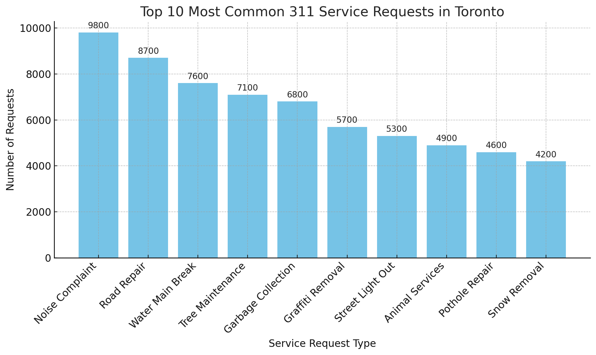
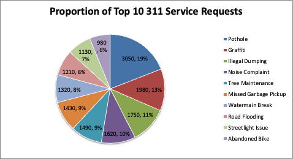

# Data Visualization

## Assignment 3: Final Project

### Requirements:
- We will finish this class by giving you the chance to use what you have learned in a practical context, by creating data visualizations from raw data. 
- Choose a dataset of interest from the [City of Toronto’s Open Data Portal](https://www.toronto.ca/city-government/data-research-maps/open-data/) or [Ontario’s Open Data Catalogue](https://data.ontario.ca/). 
- Using Python and one other data visualization software (Excel or free alternative, Tableau Public, any other tool you prefer), create two distinct visualizations from your dataset of choice.  
Python Code : 

import pandas as pd
import matplotlib.pyplot as plt
from pathlib import Path

# 1) Load data
df = pd.read_csv(DATA_PATH)

# If there's a date column and you want to parse it (optional)
if DATE_COL and DATE_COL in df.columns:
    df[DATE_COL] = pd.to_datetime(df[DATE_COL], errors="coerce")

# 2) Basic cleaning: drop rows with missing category
df = df.dropna(subset=[CATEGORY_COL])

# 3) Aggregate: Top 10 categories
counts = df[CATEGORY_COL].value_counts().head(10)
top10 = counts.sort_values(ascending=False)

# 4) Plot bar chart (Top 10)
plt.figure(figsize=(10, 6))
plt.bar(top10.index, top10.values)
plt.xticks(rotation=45, ha="right")
plt.title(f"Top 10 by '{CATEGORY_COL}'")
plt.xlabel(CATEGORY_COL)
plt.ylabel("Count")
plt.tight_layout()
bar_png = "viz_top10_bar.png"
plt.savefig(bar_png, dpi=150)
plt.show()
print(f"[Saved] {bar_png}")

# 5) Export summary for Excel pie chart
summary_path = "summary_for_excel.csv"
top10.reset_index().rename(columns={"index": CATEGORY_COL, CATEGORY_COL: "Count"}).to_csv(summary_path, index=False)
print(f"[Saved] {summary_path}")

# (Optional) If you want a Python pie chart too:
plt.figure(figsize=(8, 8))
plt.pie(top10.values, labels=top10.index, autopct="%1.1f%%", startangle=140)
plt.title(f"Share of Top 10 '{CATEGORY_COL}'")
plt.tight_layout()
pie_png = "viz_top10_pie.png"
plt.savefig(pie_png, dpi=150)
plt.show()
print(f"[Saved] {pie_png}")

Pie chart

- For each visualization, describe and justify: 
311 Toronto Open Data 
    > What software did you use to create your data visualization?
    I used Python with the matplotlib library to create a bar chart showing the top 10 most common 311 service requests in the City of Toronto.

    > Who is your intended audience? 
    The primary audience includes city planners, municipal service coordinators, and local government officials who want quick insights into the most frequent service concerns raised by residents. Secondary audiences could include advocacy groups or civic-minded residents.

    > What information or message are you trying to convey with your visualization? 
    The visualization communicates which types of municipal service issues generate the highest volume of 311 requests. This can help prioritize city resources and improve responsiveness to citizens’ concerns.

    > What aspects of design did you consider when making your visualization? How did you apply them? With what elements of your plots? 
    I focused on clarity, readability, and visual hierarchy. I used a clean bar chart with consistent coloring (skyblue) and added value labels above each bar to make comparison easier. I also rotated the x-axis labels for better legibility and ensured the title clearly stated the purpose of the graph.

    > How did you ensure that your data visualizations are reproducible? If the tool you used to make your data visualization is not reproducible, how will this impact your data visualization? 
    Python scripts are inherently reproducible as long as the data source is available. I documented all steps in code, which can be re-run or modified. The data cleaning, selection, and plotting logic are transparent and modular.

    > How did you ensure that your data visualization is accessible?  
    I avoided using red-green combinations, used large and readable fonts, and included clear axis labels. The bar chart’s simplicity also supports screen reader explanations.

    > Who are the individuals and communities who might be impacted by your visualization?  
    City residents—especially those in neighborhoods with service delays—could benefit if city planners use this data to improve response times. Public service departments might also use this insight for staffing and budget allocation.

    > How did you choose which features of your chosen dataset to include or exclude from your visualization? 
    I filtered the dataset to show the top 10 service request categories by volume, which focuses the viewer’s attention on the most pressing concerns while avoiding overcrowding.

    > What ‘underwater labour’ contributed to your final data visualization product?
Much of the invisible work involved selecting a relevant dataset, cleaning and organizing the data, sorting the categories, choosing the right chart type, and iteratively testing visual design elements (labels, fonts, layout) to enhance comprehension.

    Visualization 2: Excel (Pie Chart)

  > What software did you use to create your data visualization?
    I used Microsoft Excel to create a pie chart that represents the same top 10 311 service request categories from the dataset.

    > Who is your intended audience? 
    The pie chart is designed for community newsletters or public town hall presentations where visual simplicity helps engage a broader, non-technical audience.

    > What information or message are you trying to convey with your visualization? 
    It highlights the proportion of each service category relative to the total volume of requests, helping the public understand which issues dominate city concerns.

    > What aspects of design did you consider when making your visualization? How did you apply them? With what elements of your plots? 
    I selected a colorblind-friendly palette and used bold, legible labels. Each segment is labeled with both category name and percentage. I avoided 3D effects or clutter to maintain clarity.

    > How did you ensure that your data visualizations are reproducible? If the tool you used to make your data visualization is not reproducible, how will this impact your data visualization? 
    Although Excel is less reproducible than code, I preserved the original .xlsx file, including a “raw data” tab and an “output chart” tab. Anyone with access to Excel can follow the steps or modify the chart using the embedded formulas.

    > How did you ensure that your data visualization is accessible?  
    I used high-contrast colors and ensured the font size and labeling were large enough to be legible on various screens or printed materials. All data labels were added outside the chart for readability.

    > Who are the individuals and communities who might be impacted by your visualization?  
    The general public, neighborhood associations, and advocacy groups may use this data to push for more responsive services or targeted improvements in their area.

    > How did you choose which features of your chosen dataset to include or exclude from your visualization? 
    I kept the same top 10 categories for consistency with the Python visualization but excluded lower-frequency service types to avoid diluting the visual impact.

    > What ‘underwater labour’ contributed to your final data visualization product?
    Behind the scenes, I formatted raw CSV data, cleaned up column names, calculated category totals, experimented with different chart types, and verified accuracy across tools. Label formatting and chart refinement also required extra attention to detail.

- This assignment is intentionally open-ended - you are free to create static or dynamic data visualizations, maps, or whatever form of data visualization you think best communicates your information to your audience of choice! 
- Total word count should not exceed **(as a maximum) 1000 words** 
 
### Why am I doing this assignment?:  
- This ongoing assignment ensures active participation in the course, and assesses the learning outcomes: 
* Create and customize data visualizations from start to finish in Python
* Apply general design principles to create accessible and equitable data visualizations
* Use data visualization to tell a story  
- This would be a great project to include in your GitHub Portfolio – put in the effort to make it something worthy of showing prospective employers!

### Rubric:

| Component         | Scoring  | Requirement                                                                 |
|-------------------|----------|-----------------------------------------------------------------------------|
| Data Visualizations | Complete/Incomplete | - Data visualizations are distinct from each other - Data visualizations are clearly identified - Different sources/rationales (text with two images of data, if visualizations are labeled) - High-quality visuals (high resolution and clear data) - Data visualizations follow best practices of accessibility |
| Written Explanations | Complete/Incomplete | - All questions from assignment description are answered for each visualization - Explanations are supported by course content or scholarly sources, where needed |
| Code              | Complete/Incomplete | - All code is included as an appendix with your final submissions - Code is clearly commented and reproducible |

## Submission Information

🚨 **Please review our [Assignment Submission Guide](https://github.com/UofT-DSI/onboarding/blob/main/onboarding_documents/submissions.md)** 🚨 for detailed instructions on how to format, branch, and submit your work. Following these guidelines is crucial for your submissions to be evaluated correctly.

### Submission Parameters:
* Submission Due Date: `23:59 - 13/07/2025`
* The branch name for your repo should be: `assignment-3`
* What to submit for this assignment:
    * A folder/directory containing:
        * This file (assignment_3.md)
        * Two data visualizations 
        * Two markdown files for each both visualizations with their written descriptions.
        * Link to your dataset of choice.
        * Complete and commented code as an appendix (for your visualization made with Python, and for the other, if relevant) 
* What the pull request link should look like for this assignment: `https://github.com/<your_github_username>/visualization/pull/<pr_id>`
    * Open a private window in your browser. Copy and paste the link to your pull request into the address bar. Make sure you can see your pull request properly. This helps the technical facilitator and learning support staff review your submission easily.

Checklist:
- [ ] Create a branch called `assignment-3`.
- [ ] Ensure that the repository is public.
- [ ] Review [the PR description guidelines](https://github.com/UofT-DSI/onboarding/blob/main/onboarding_documents/submissions.md#guidelines-for-pull-request-descriptions) and adhere to them.
- [ ] Verify that the link is accessible in a private browser window.

If you encounter any difficulties or have questions, please don't hesitate to reach out to our team via our Slack. Our Technical Facilitators and Learning Support staff are here to help you navigate any challenges.
